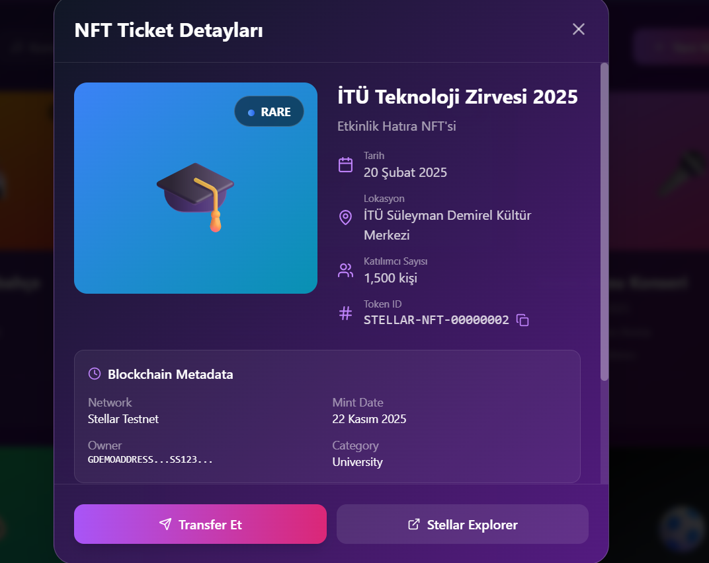
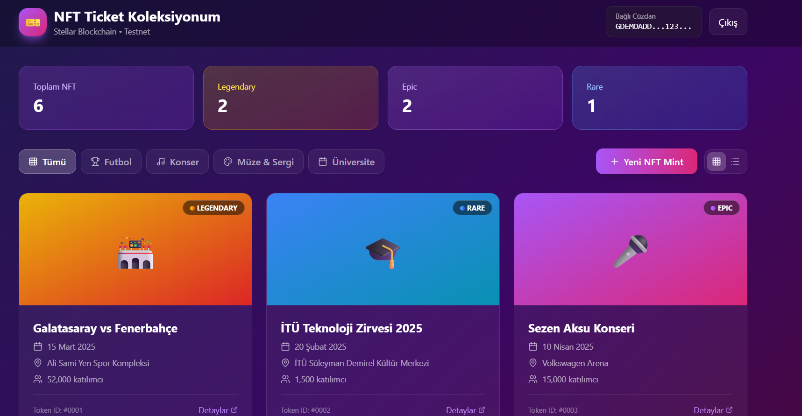

# 🎫 Stellar NFT Ticket Collection Platform

A modern, interactive NFT ticket collection platform built on Stellar blockchain for storing and managing event memories as digital collectibles.

  

## 🌟 Overview

Transform your event experiences into collectible NFTs! This platform allows users to mint, collect, and manage NFT tickets from various events including sports matches, concerts, museum exhibitions, and university events on the Stellar blockchain.

### Why Stellar?

- ⚡ **Lightning Fast**: Transactions settle in 3-5 seconds
- 💰 **Ultra Low Fees**: Mint costs only ~0.00001 XLM ($0.000001)
- 🎨 **Rich Metadata**: Store comprehensive event details
- 🔄 **Easy Transfers**: Seamless NFT transfers between wallets

## ✨ Features

### 🎯 Core Features

- **NFT Collection Management**: View and organize your event NFT tickets
- **Advanced Search & Filter**: Real-time search by event name or location
- **Smart Sorting**: Sort by date, rarity, or attendance
- **Rarity System**: 
  - 🟤 Common
  - 🔵 Rare
  - 🟣 Epic
  - 🟡 Legendary
- **Category Filtering**: Football, Concerts, Museums, University Events
- **Dual View Modes**: Grid and List layouts
- **NFT Minting**: Create new event ticket NFTs
- **Transfer System**: Send NFTs to other Stellar addresses
- **Transaction History**: Track all NFT operations

### 🎨 UI/UX Features

- **Modern Design**: Glassmorphism with gradient overlays
- **Smooth Animations**: 
  - Cascade fade-in effects
  - Hover transformations
  - Pulse animations on rarity badges
  - Success celebration animations
- **Responsive Layout**: Mobile-first design
- **Interactive Cards**: Detailed hover effects and previews
- **Real-time Statistics**: Collection overview with trends

### 🔐 Blockchain Features

- **Stellar Integration**: Native blockchain connectivity
- **Wallet Connection**: Support for Stellar wallets (Freighter, xBull, Lobstr, Albedo)
- **Token ID System**: Unique identifier for each NFT
- **Metadata Storage**: Event details, date, location, attendance
- **Blockchain Explorer**: Direct links to Stellar Explorer

## 🚀 Getting Started

### Prerequisites

```bash
Node.js >= 18.0.0
npm or yarn
A Stellar-compatible wallet (for testnet)
```

### Installation

1. **Clone the repository**
```bash
git clone https://github.com/yourusername/stellar-nft-tickets.git
cd stellar-nft-tickets
```

2. **Install dependencies**
```bash
npm install
# or
yarn install
```

3. **Run the development server**
```bash
npm run dev
# or
yarn dev
```

4. **Open your browser**
```
Navigate to http://localhost:3000
```

### Wallet Setup

1. Install a Stellar wallet extension (recommended: Freighter)
2. Create a testnet account
3. Fund your account using Stellar Friendbot
4. Connect your wallet to the platform

## 💡 Use Cases

### 🏟️ Sports Clubs
- Match attendance badges
- Season ticket NFTs
- Derby and championship special editions
- Player meet-and-greet certificates

### 🎓 Universities
- Graduation ceremony NFTs
- Seminar participation certificates
- Academic achievement badges
- Campus event memorabilia

### 🎨 Museums & Art
- Digital exhibition tickets
- Gallery visit NFTs
- Special collection access passes
- Art event attendance proofs

### 🎵 Concerts & Festivals
- Concert ticket NFTs
- Festival attendance badges
- VIP experience certificates
- Artist meet-and-greet passes

## 🛠️ Technology Stack

### Frontend
- **React 18**: UI framework
- **TypeScript**: Type safety
- **Tailwind CSS**: Styling
- **Lucide React**: Icon library

### Blockchain
- **Stellar SDK**: Blockchain integration
- **Stellar Network**: Testnet environment

### Features
- **Real-time Search**: Instant filtering
- **Advanced Animations**: CSS & React animations
- **Responsive Design**: Mobile-first approach

## 📊 Project Structure

```
stellar-nft-tickets/
├── components/
│   ├── WalletConnection.tsx
│   ├── BalanceDisplay.tsx
│   ├── PaymentForm.tsx
│   └── TransactionHistory.tsx
├── lib/
│   └── stellar-helper.ts
├── pages/
│   └── index.tsx
├── public/
└── styles/
    └── globals.css
```

## 🎮 How to Use

### 1. Connect Wallet
- Click "Cüzdan Bağla" (Connect Wallet)
- Approve the connection in your Stellar wallet

### 2. Browse Collection
- View your NFT collection in grid or list mode
- Use search to find specific events
- Filter by category (Football, Concert, Museum, University)
- Sort by date, rarity, or attendance

### 3. View NFT Details
- Click on any NFT card
- View complete event information
- Check blockchain metadata
- See transaction history

### 4. Transfer NFT
- Open NFT details
- Click "Transfer Et" (Transfer)
- Enter recipient Stellar address
- Confirm transaction
- Wait for success animation

### 5. Mint New NFT
- Click "Yeni Mint" (New Mint)
- Fill in event details:
  - Event name
  - Category
  - Date and time
  - Location
- Confirm to mint on Stellar blockchain

## 📈 Statistics & Analytics

The platform provides real-time statistics:
- **Total NFTs**: Your complete collection count
- **Legendary**: Most valuable NFTs
- **Epic**: Special event NFTs
- **Rare**: Limited edition NFTs
- **Monthly Trends**: Growth indicators

## 🎨 Rarity System

NFTs are assigned rarity based on event significance:

| Rarity | Color | Events |
|--------|-------|--------|
| Legendary | 🟡 Gold/Orange | Major derbies, Championships |
| Epic | 🟣 Purple | Special matches, Major concerts |
| Rare | 🔵 Blue | Notable events, University ceremonies |
| Common | ⚪ Gray | Regular events, Standard exhibitions |

## 🔒 Security

- **Testnet Only**: This is a demonstration platform
- **No Real Funds**: Never use mainnet assets
- **Wallet Security**: Always verify transaction details
- **Safe Transfers**: Confirmation dialogs before actions

## 🚧 Roadmap

- [ ] Mainnet deployment
- [ ] QR code verification for event entry
- [ ] NFT marketplace integration
- [ ] Social sharing features
- [ ] Batch minting for event organizers
- [ ] Mobile app (iOS/Android)
- [ ] Multi-chain support
- [ ] IPFS metadata storage
- [ ] Advanced analytics dashboard
- [ ] Event organizer dashboard

## 🤝 Contributing

Contributions are welcome! Please follow these steps:

1. Fork the repository
2. Create a feature branch (`git checkout -b feature/AmazingFeature`)
3. Commit your changes (`git commit -m 'Add some AmazingFeature'`)
4. Push to the branch (`git push origin feature/AmazingFeature`)
5. Open a Pull Request

## 📸 Screenshots





## 📝 License

This project is licensed under the MIT License - see the [LICENSE](LICENSE) file for details.

## 🙏 Acknowledgments

- [Stellar Development Foundation](https://stellar.org) for the blockchain infrastructure
- [Lucide](https://lucide.dev) for beautiful icons
- [Tailwind CSS](https://tailwindcss.com) for styling utilities
- Community contributors and testers

## 📞 Contact & Support

- **GitHub Issues**: [Report a bug](https://github.com/yourusername/stellar-nft-tickets/issues)
- **Stellar Community**: [Join Discord](https://discord.gg/stellar)
- **Documentation**: [Stellar Docs](https://developers.stellar.org)

## ⚠️ Disclaimer

This is a demonstration application running on Stellar Testnet. Do not use real funds or mainnet accounts. Always verify you're on testnet before any transactions.

---

**Built with ❤️ on Stellar Blockchain**

*Transform your memories into collectibles* 🎫✨